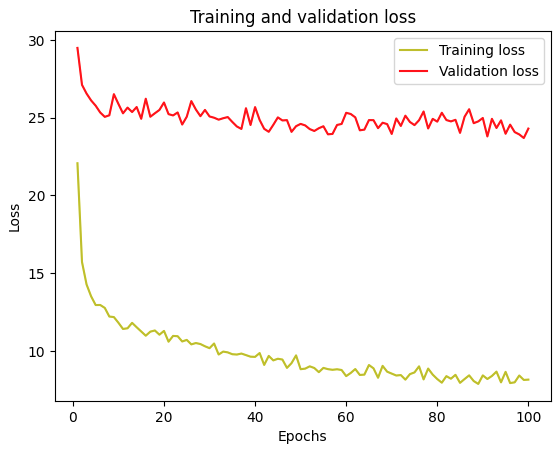
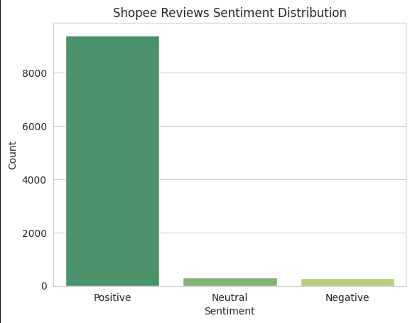
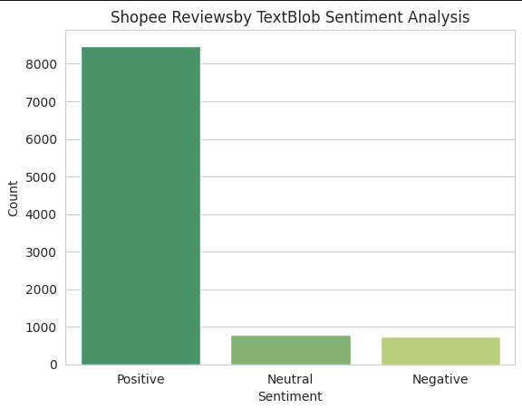

# Visitor Spend Prediction & Review Sentiment Analysis

## Overview
This project covers two independent machine learning problems: predicting how much international visitors will spend in London using a neural network, and analyzing customer sentiment in e-commerce reviews. Together they demonstrate regression modelling, model benchmarking, and NLP-based sentiment analysis in a single applied workflow.

## Part 1: Predicting Visitor Spend with a Neural Network

### Approach
* Built a regression pipeline on the VisitBritain International Visitors London dataset, predicting visitor `Spend (£m)` from features like market, purpose of visit, duration of stay, and travel mode.
* One-hot encoded all categorical features and applied `StandardScaler` to normalize the numeric ranges.
* Built a Sequential neural network (Keras/TensorFlow) with Dense layers and Dropout, tuned through experimentation (settled on 200 epochs, batch size 32, after testing 100/250 epochs).
* Benchmarked the neural network against a `RandomForestRegressor` to validate model choice.
* Tested the trained model against a synthetic new visitor profile to confirm it generalizes to unseen input.

### Results

| Model          | MAE    | RMSE   | R²     |
|----------------|--------|--------|--------|
| Neural Network | 1.3173 | 5.0571 | 0.5803 |
| Random Forest  | 1.2536 | 5.3157 | 0.5363 |

The neural network was chosen as the better model overall — it wins on R² and RMSE, while Random Forest only edges ahead slightly on MAE. The model explains about 58% of the variance in visitor spend; the remainder is likely driven by factors outside this dataset.

## Part 2: Shopee Review Sentiment Analysis

### Approach
* Labeled 10,000 Shopee product reviews by converting their 1–5 star rating into a `Positive` / `Neutral` / `Negative` category.
* Independently scored the same review text using `TextBlob`'s sentiment analysis, to see whether the star rating actually matches the sentiment of the written review.
* Compared the two labeling approaches side by side.

### Results

| Sentiment | From Star Rating | From TextBlob (text analysis) |
|-----------|------------------|-------------------------------|
| Positive  | 9,405            | 8,475                         |
| Neutral   | 315              | 796                           |
| Negative  | 279              | 728                           |

Star ratings alone overstate how positive customers actually are — nearly 1,000 reviews rated 4–5 stars contained language TextBlob scored as neutral or negative. This shows why relying on star ratings alone can hide dissatisfaction that only shows up in the review text itself.

## Tech Stack & Dependencies
* **Core Language:** Python 3 (developed in Google Colab)
* **Modelling:** TensorFlow / Keras (Sequential neural network), scikit-learn (`RandomForestRegressor`, preprocessing, metrics)
* **NLP:** TextBlob
* **Data handling & visualization:** pandas, numpy, matplotlib, seaborn

## Data Sources & Attribution
* **International Visitors London dataset** — VisitBritain, provided as coursework material via CCT College Dublin (Moodle). Included directly in this repo under `DataSets/`.
* **Shopee Text Reviews dataset** — [Shopee Text Reviews](https://www.kaggle.com/datasets/shymammoth/shopee-reviews) by shymammoth, on Kaggle (137MB). Not committed to this repo due to GitHub's file size limit — see `DataSets/README.md` for download instructions. Note: only the first 10,000 rows were used.

## Repository Structure
* `visitor_spend_and_review_sentiment.ipynb` — Full notebook covering both the neural network regression model and the sentiment analysis.
* `DataSets/` — Included dataset plus instructions for obtaining the Shopee reviews dataset (see `DataSets/README.md`).

## How to Run
This notebook was originally built in Google Colab, so the first cell of each part uses `google.colab.files.upload()` to load the CSVs. To run locally in Jupyter, replace those upload cells with a direct `pd.read_csv('DataSets/filename.csv')` call instead.

## References
* Chollet, F. (2015) *Keras*. Available at: https://keras.io
* Pedregosa, F. et al. (2011) 'Scikit-learn: Machine Learning in Python', *Journal of Machine Learning Research*, 12, pp. 2825-2830. Available at: https://scikit-learn.org
* Loria, S. (2018) *TextBlob Documentation*. Available at: https://textblob.readthedocs.io
* TensorFlow Developers (2023) *TensorFlow*. Available at: https://www.tensorflow.org
* Visit Britain (2023) *International Visitors London Dataset*. Available via Moodle, CCT College Dublin.
* shymammoth (n.d.) *Shopee Text Reviews*. Kaggle. Available at: https://www.kaggle.com/datasets/shymammoth/shopee-reviews
